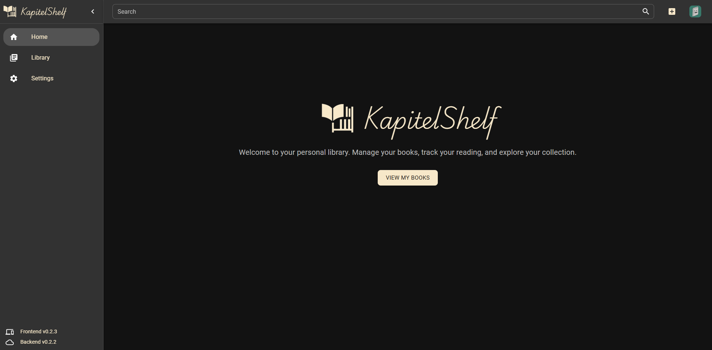

# KapitelShelf

KapitelShelf is a modern web app for managing and reading your personal book library.  
It supports both digital books (EPUB, PDF, etc.) and physical collections, with a clean interface for browsing and managing your library.

## Features

- Manage physical and digital books with file support
- Browse and search books, series, author and tags
- Shelves and filtering (tags, categories, series, location) _(planned)_
- Import and sync books from cloud storages (OneDrive)
  - Bulk import from CSV ([see References](docs/references/book-management.md#bulk-import-from-csv))
- Full user metadata editing (notes, favourite)
  - Import metadata from Amazon, Google and OpenLibrary ([see References](docs/references/metadata.md#import-metadata-for-a-book))
- User Profiles that sync settings across devices
- AI features like automatic metadata generation and AI search
- Responsive UI (desktop, tablet, mobile)
- Available on Web and Android
- OPDS support for eReaders _(planned)_

## Installation

Refer to the [Installation Guide](docs/installation.md) for instructions.

## Quick Start

See the [Quickstart Guide](docs/quickstart.md) for an introduction to using KapitelShelf.

## Documentation

- [Installation Guide](docs/installation.md)
- [Quickstart Guide](docs/quickstart.md)
- [Development Guide](docs/development.md)
- [Helm Chart](helm/kapitelshelf/README.md)
- [Examples](examples/README.md)
- [References](docs/references.md)
- [FAQ](docs/faq.md)

## Development

### Technologies

|          |                                                                                                                                                      |
| -------- | ---------------------------------------------------------------------------------------------------------------------------------------------------- |
| Frontend | [Vite](https://vitejs.dev/) • [React](https://react.dev/) • [MUI](https://mui.com/)                                                                  |
| Backend  | [ASP.NET Core](https://learn.microsoft.com/en-us/aspnet/core/) • [EF Core](https://learn.microsoft.com/en-us/ef/core/) • [NUnit](https://nunit.org/) |
| Database | [PostgreSQL](https://www.postgresql.org/)                                                                                                            |

### Guide

Refer to the [Development Guide](docs/development.md) for instructions.

Contributions are welcome! Please read the [Contributing Guide](./CONTRIBUTING.md).

## Support

If you like KapitelShelf, consider giving a ⭐ on GitHub!

## License

KapitelShelf is licensed under the MIT License.  
See [LICENSE](./LICENSE) for more information.

## Credits

❤️ Special thanks to [Leonie Tröster](https://leonie-troester.de/) for drawing the wonderful images featured in KapitelShelf.

## Fun Fact

The name **KapitelShelf** combines the German word **"Kapitel"** (meaning _chapter_) and the English word **"Shelf"**.  
It's a simple nod to organizing your collection of books, one chapter at a time.

> "KapitelShelf - Organizing chaos, one chapter at a time."
