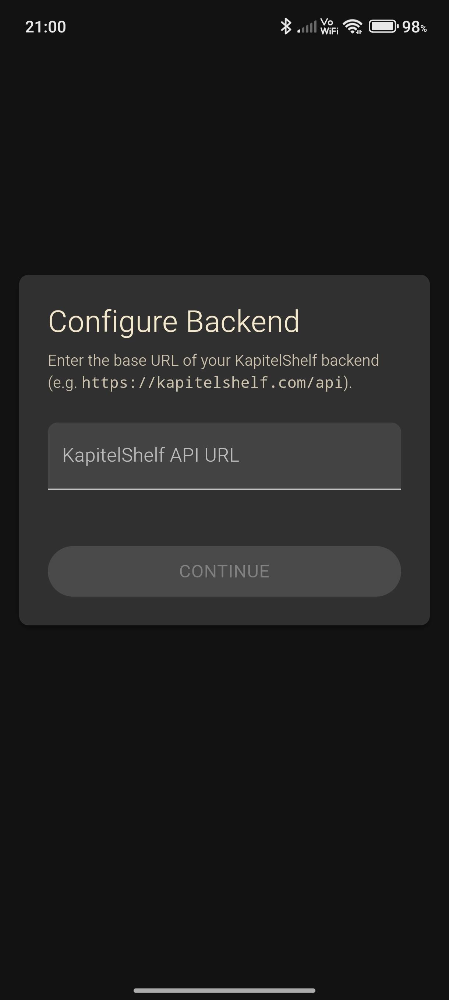
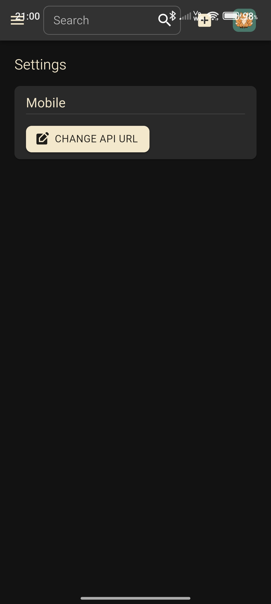

# Installation Guide

Installation methods:

- [Helm Chart](#helm-chart)
- [docker-compose](#docker-compose)
- [Docker (Standalone)](#docker-standalone)
- [Mobile (Android)](#mobile-android)

> ⚠️ KapitelShelf relies on a PostgreSQL database, but the docker images **do not** include a database server - you must configure your own PostgreSQL connection via environment variables.

> ℹ️ If you'd prefer not to install and manage PostgreSQL yourself, either the below helm chart or the docker-compose file will automatically set up and configure a PostgreSQL instance for you.

## Helm Chart

Deploy KapitelShelf to your Kubernetes cluster using a Helm chart. This option installs all core components (frontend, API, migrator) and can optionally provision a bundled PostgreSQL database.

For a detailed installation and configuration options see the Helm chart's [README](../helm/kapitelshelf/README.md).

## docker-compose

You can find an example `docker-compose.yaml` file in [examples/docker-compose](../examples/docker-compose/docker-compose.yaml).

## Docker (Standalone)

If you prefer to manage each container yourself.

### Registry

The docker images are published on:

|          | Image                                  | Registries                                                                                                                                                                  |
| -------- | -------------------------------------- | --------------------------------------------------------------------------------------------------------------------------------------------------------------------------- |
| Frontend | `thomasmiller01/kapitelshelf-frontend` | [DockerHub](https://hub.docker.com/r/thomasmiller01/kapitelshelf-frontend) • [ghcr.io](https://github.com/thomasmiller01/KapitelShelf/pkgs/container/kapitelshelf-frontend) |
| API      | `thomasmiller01/kapitelshelf-api`      | [DockerHub](https://hub.docker.com/r/thomasmiller01/kapitelshelf-api) • [ghcr.io](https://github.com/thomasmiller01/KapitelShelf/pkgs/container/kapitelshelf-api)           |

### Frontend

```bash
docker run -d \
    --name=kapitelshelf-frontend \
    -p 5173:5173 \
    -e VITE_KAPITELSHELF_API=http://localhost:5261 \
    --restart unless-stopped \
    thomasmiller01/kapitelshelf-frontend
```

#### Environment Variables

| Environment Variable    | Default                 |
| ----------------------- | ----------------------- |
| `VITE_KAPITELSHELF_API` | `http://localhost:5261` |

### API

```bash
docker run -d \
    --name=kapitelshelf-api \
    -p 5261:5261 \
    -e KapitelShelf__DataDir=./data \
    -e KapitelShelf__Database__Host=host.docker.internal:5432 \
    -e KapitelShelf__Database__Username=kapitelshelf \
    -e KapitelShelf__Database__Password=kapitelshelf \
    -e KapitelShelf__Domain=https://localhost:5261 \
    -v ./data:/var/lib/kapitelshelf/data
    --restart unless-stopped \
    thomasmiller01/kapitelshelf-api
```

#### Environment Variables

| Environment Variable               | Default                      | Settings Path (appsettings.json) |
| ---------------------------------- | ---------------------------- | -------------------------------- |
| `KapitelShelf__DataDir`            | `/var/lib/kapitelshelf/data` | `KapitelShelf.DataDir`           |
| `KapitelShelf__Database__Host`     | `host.docker.internal:5432`  | `KapitelShelf.Database.Host`     |
| `KapitelShelf__Database__Username` | `kapitelshelf`               | `KapitelShelf.Database.Username` |
| `KapitelShelf__Database__Password` | `kapitelshelf`               | `KapitelShelf.Database.Password` |
| `KapitelShelf__Domain`             | `https://localhost:5261`     | `KapitelShelf.Domain`            |

## Mobile (Android)

> [Why is KapitelShelf only available on Android and not on iOS?](./faq.md#why-is-kapitelshelf-only-available-on-android-and-not-on-ios)

To use the mobile app, you must first have a KapitelShelf backend up and running.

The easiest way to do this is by using either:

- [Helm Chart](#helm-chart) - recommended for Kubernetes setups
- [docker-compose](#docker-compose) - simple and local, but make sure your backend is reachable over the network from your mobile device

Once your backend is running:

1. Visit the [KapitelShelf Releases](https://github.com/ThomasMiller01/KapitelShelf/releases?q=frontend&expanded=true).
2. Locate the **latest** `frontend@x.y.z` release.
3. Under **Assets**, download the APK file named `KapitelShelf-x.y.z.apk` _(with `x.y.z` being the version of the release)_.
4. Install this APK on your Android device. You may need to enable "Install unknown apps" in your Android settings.

Once installed, open the app. You'll be prompted to configure the URL of your KapitelShelf backend:



You can change this later by opening the **Settings** menu (left sidebar) and clicking the **Change API URL** button:


