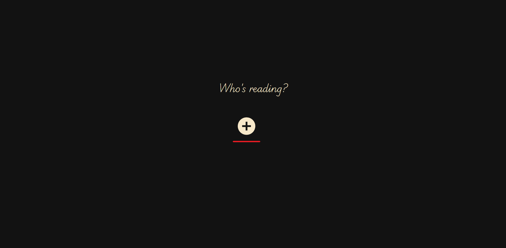
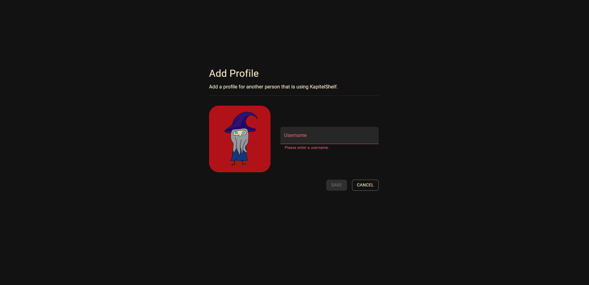

# Quickstart Guide

**Welcome to KapitelShelf!**

This quickstart guide shows you how to begin using the app and manage your book collection.

## 1. Access the KapitelShelf frontend

Open your browser and navigate to:

```
http://localhost:5173
```

> ℹ️ The url can **vary** based on how you installed it. <br /> **docker-compose** & **Docker** => use the url provided above <br /> **Helm** => navigate to the url you configured via the `frontend.ingress` value

## 2. Create a User Profile

1. Click on the "+" (plus) button to start creating a new user profile



2. Fill in the username and click the "Save" button



## 3. Add Your First Book

1. Click the `+` button on the top right.


2. Click the `Create Book` button _(directly below)_.


3. Fill out the book details: _title_, _description_, ...
4. _**[Optional]**_ Import metadata as described in [Import Metadata for a Book](./references.md#import-metadata-for-a-book).
5. Click the `Create Book` button on the bottom right.

Your book now appears in your collection.

## 4. Browse Your Collection

After adding books, you can visit your personal library.

1. Click on `Library` to see your book collection


> ℹ️ On the library page, you’ll see all your series listed. <br /> To view the books in a specific series, see [4. View Series Details](#4-view-series-details).

## Help and Support

- For questions, visit the [General](https://github.com/ThomasMiller01/KapitelShelf/discussions/categories/general) section of the discussions on GitHub.
- For bugs, [open an issue](https://github.com/ThomasMiller01/KapitelShelf/issues) on GitHub.
- Check the [References](./references.md) for advanced usage and more details.
- Check the [FAQ](./faq.md) for frequently asked questions.

---

**🎉 Enjoy organizing your library with KapitelShelf!**
