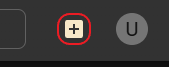
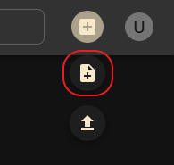
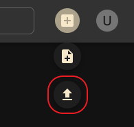
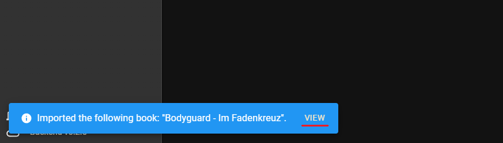

# Quickstart Guide

**Welcome to KapitelShelf!**

This quickstart guide shows you how to begin using the app and manage your book collection.

## 1. Access the KapitelShelf frontend

Open your browser and navigate to:

```
http://localhost:5173
```

> ℹ️ The url can **vary** based on how you installed it. <br /> **docker-compose** & **Docker**: use the url provided above <br /> **Helm**: navigate to the url configured via the `frontend.ingress` values

## 2. Add Your First Book

1. Click the `+` button on the top right.



2. Click the `Create Book` button _(directly below)_.



3. Fill out the book details: _title_, _description_, ...
4. _**(Optional)**_ Import metadata _(automatically)_, click the button on the bottom left.
5. Click the `Create Book` button on the bottom right.

Your book now appears in your collection.

## 3. Import a Book

1. Click the `+` button on the top right as before.
2. Click the `Import Book` button.



3. **Drag & Drop** your book files into the dotted area _or_ **click on the dotted area** and select your books to import.
4. Click on `View` in the success notification to navigate to the newly imported book.



## 4. Browse Your Collection

> Coming soon

## 5. View Series Details

> Coming soon

## 6. View Book Details

> Coming soon

## 7. Search Books

> Coming soon

## 8. Edit a Series or Book

> Coming soon

## 9. Delete a Series or Book

> Coming soon

## Tips

- **Responsive design:** KapitelShelf works on desktop and mobile.
- **Book files:** Supported formats include EPUB, FB2, PDF and more.

## Help and Support

- For questions, visit the [General](https://github.com/ThomasMiller01/KapitelShelf/discussions/categories/general) section of the dicussions on GitHub.
- For bugs, [open an issue](https://github.com/ThomasMiller01/KapitelShelf/issues) on GitHub.
- Check the [References](#) for advanced usage and more details. _(planned)_

---

🎉 Enjoy organizing your library with KapitelShelf!
