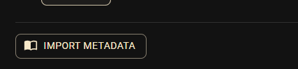
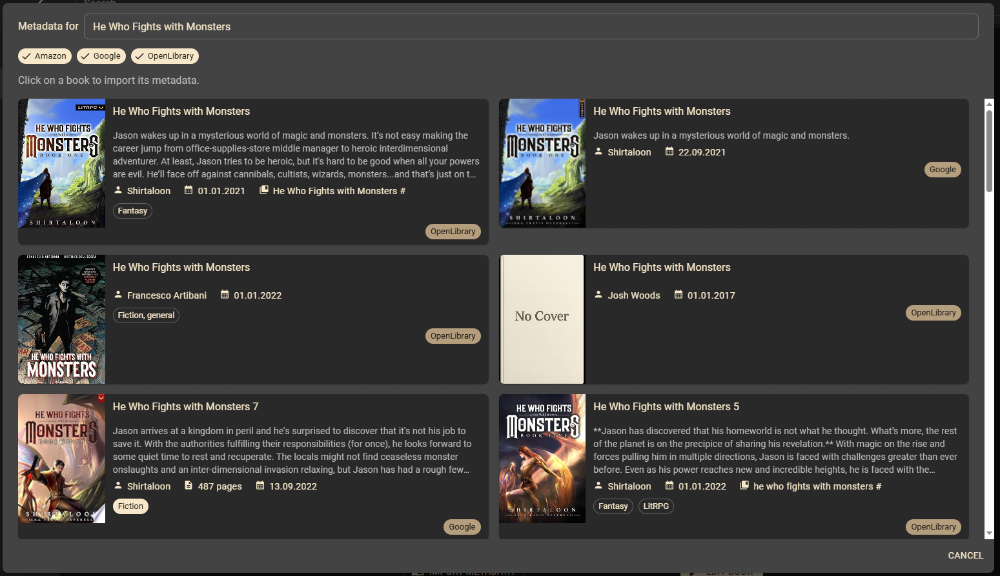
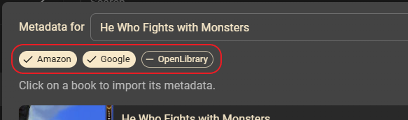
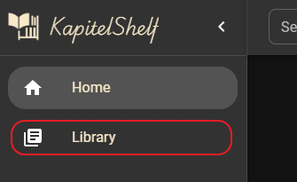
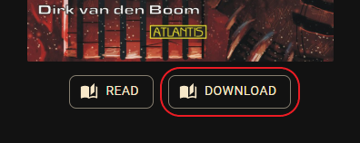
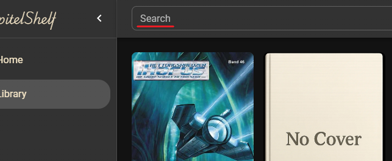
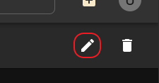
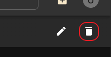
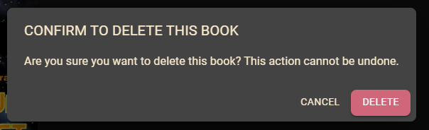

# Quickstart Guide

**Welcome to KapitelShelf!**

This quickstart guide shows you how to begin using the app and manage your book collection.

## 1. Access the KapitelShelf frontend

Open your browser and navigate to:

```
http://localhost:5173
```

> ℹ️ The url can **vary** based on how you installed it. <br /> **docker-compose** & **Docker** => use the url provided above <br /> **Helm** => navigate to the url configured via the `frontend.ingress` values

## 2. Add Your First Book

1. Click the `+` button on the top right.


2. Click the `Create Book` button _(directly below)_.


3. Fill out the book details: _title_, _description_, ...
4. _**[Optional]**_ Import metadata as described in [2.3. Import Metadata](#23-import-metadata).
5. Click the `Create Book` button on the bottom right.

Your book now appears in your collection.

## 2.1. Import a Book

1. Click the `+` button on the top right as before.
2. Click the `Import Book` button.


3. **Drag & Drop** your book files into the dotted area _or_ **click on the dotted area** and select your books to import.
4. Click on `View` in the success notification to navigate to the newly imported book.


## 2.2. Import in bulk from .csv

KapitelShelf supports importing your entire library from a CSV file, allowing you to quickly add multiple books at once.

1. Go to the `Import Book` dialog as described in [2.1. Import a Book](#21-import-a-book).
2. Select your prepared `.csv` file.
3. KapitelShelf will process each row in the file and create a new book for each.
4. You will receive a summary of the books created and any errors.

> ℹ️ If a row is missing a required property (e.g. Title), it will be skipped.

### Required Format

Your CSV file must have the following columns and structure:

| Title\*  | Description | Author   | ReleaseDate | SeriesName | SeriesNumber | Pages | Tags                | Categories          | LocationType | LocationValue |
| -------- | ----------- | -------- | ----------- | ---------- | ------------ | ----- | ------------------- | ------------------- | ------------ | ------------- |
| `string` | `string`    | `string` | `string`    | `string`   | `int`        | `int` | `string,string,...` | `string,string,...` | `enum`       | `string`      |

- **Title**: `string` (required)
- **Description**: `string`
- **Author**: `string` (FirstName and LastName, separated by a space)
- **ReleaseDate**: `string` (UTC format: `YYYY-mm-ddTHH:MM:ss.fffZ`)
- **SeriesName**: `string`
- **SeriesNumber**: `int` (>= 0)
- **Pages**: `int` (>= 0)
- **Tags**: `string` (comma-separated list)
- **Categories**: `string` (comma-separated list)
- **LocationType**: `string` (`Physical`, `KapitelShelf`, `Kindle`, `Skoobe`, `Onleihe`, `Library`)
- **LocationValue**: `string` (set only if LocationType requires a value)

### Example Rows

| Title      | Description    | Author   | ReleaseDate              | SeriesName | SeriesNumber | Pages | Tags                | Categories                    | LocationType | LocationValue                          |
| ---------- | -------------- | -------- | ------------------------ | ---------- | ------------ | ----- | ------------------- | ----------------------------- | ------------ | -------------------------------------- |
| My Title   | My Description | Jane Doe | 2023-04-23T15:20:17.357Z | My Series  | 1            | 100   | Tag1,Tag2           | Category1,Category2           | Skoobe       | https://www.skoobe.de/books/mybook     |
| My Title 2 | My Description | Jane     | 2023-04-23T15:20:17.357Z | My Series  | 1            | 100   | My Special Tag,Tag2 | My Special Category,Category2 | Kindle       | https://www.amazon.de/mybook/dp/bookid |

## 2.3. Import metadata

1. Click the "Import Metadata" button



KapitelShelf will automatically look for book metadata from the available sources.

> The book **title** will be used as the search key.



2. Click on a book to import the shown metadata

> The metadata will overwrite existing values.

### Filter sources

You can exclude/include metadata sources by clicking on them.



## 3. Browse Your Collection

After adding books, you can visit your personal library.

1. Click on `Library` to see your book collection



> ℹ️ On the library page, you’ll see all your series listed. <br /> To view the books in a specific series, see [5. View Series Details](#5-view-series-details).

## 4. View Series Details

On the library page, click on any series from the list to open its details page.

You'll now see all books that belong to this series, displayed in order.

## 4.1. View Book Details

On the series details page, click on any book from the list to open its details page.

Here you can see all information about the book, including title, description, cover image and more.

### Read Book

> Coming soon

### Download Book File

If a **file is available** for the book, you can download it using the `Download` button below the cover image.



## 5. Search Books

Use the **search bar** at the top of the page to find books in your collection by title, author or keyword.



## 6. Edit a Book (or Series)

Visit the book (series) details page and click the `Edit` _(pencil icon)_ button.



Now edit the book details: _title_, _description_, ...

Click the `Edit Book` button on the bottom right to save your changes.

## 7. Delete a Book (or Series)

> ℹ️ Deleting a **book** will delete **all associated files** (e.g. cover, book file).

> ⚠️ Deleting a **series** will also delete **all associated books**.

Visit the book (series) details page and click the `Delete` _(trash icon)_ button.



Now **confirm** the deletion in the dialog via the red `Delete` button.



## Tips

- **Responsive design:** KapitelShelf works on desktop and mobile.
- **Book files:** Supported formats include EPUB, FB2, PDF and more.

## Help and Support

- For questions, visit the [General](https://github.com/ThomasMiller01/KapitelShelf/discussions/categories/general) section of the discussions on GitHub.
- For bugs, [open an issue](https://github.com/ThomasMiller01/KapitelShelf/issues) on GitHub.
- Check the [References](#) for advanced usage and more details. _(planned)_

---

**🎉 Enjoy organizing your library with KapitelShelf!**
