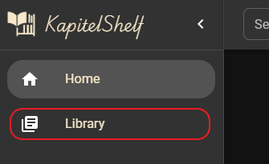
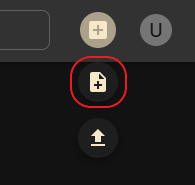
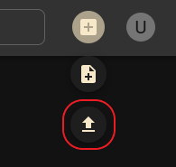
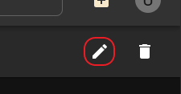
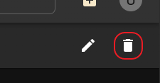
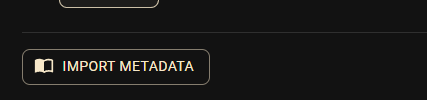
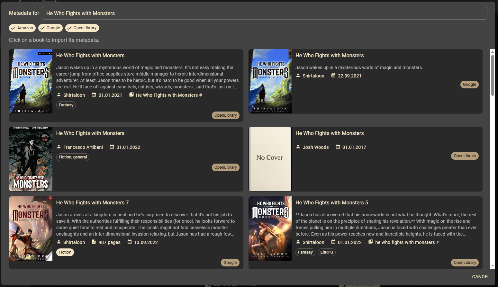
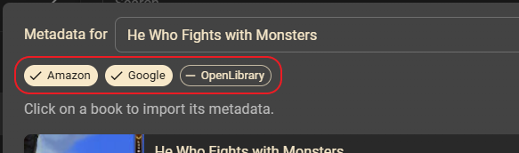
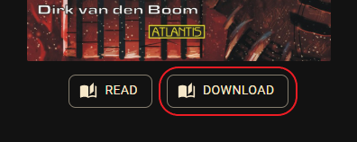

# References

**Table of Contents:**

- [Library](#library)
- [Search](#search)
- [Add a Book](#add-a-book)
- [Edit a Book](#edit-a-book)
- [Delete a Book](#delete-a-book)
- [Metadata](#metadata)
- [File Handling](#file-handling)

## Library

1. Click on `Library` to see your book collection

> ℹ️ On the library page, you’ll see all your series listed.   To view the books in a specific series, see [4. View Series Details](./quickstart.md#4-view-series-details).

## Search

> The search will look through the `title`, `description`, `series name`, `author`, `tags` and `categories`.

Use the **search bar** at the top of the page to find books in your collection by title, author or keyword.

## Add a Book

### Manually

1. Click the `+` button on the top right.

2. Click the `Create Book` button _(directly below)_.

3. Fill out the book details: _title_, _description_, ...
4. _**[Optional]**_ Import metadata as described in [Import Metadata for a Book](#import-metadata-for-a-book).
5. Click the `Create Book` button on the bottom right.

### Import from a File

1. Click the `+` button on the top right as before.
2. Click the `Import Book` button.

3. **Drag & Drop** your book files into the dotted area _or_ **click on the dotted area** and select your books to import.
4. Click on `View` in the success notification to navigate to the newly imported book.

### Import in bulk from .csv

KapitelShelf supports importing your entire library from a CSV file, allowing you to quickly add multiple books at once.

1. Go to the `Import Book` dialog as described in [Import from a File](#import-from-a-file).
2. Select your prepared `.csv` file.
3. KapitelShelf will process each row in the file and create a new book for each.
4. You will receive a summary of the books created and any errors.

> ℹ️ If a row is missing a required property (e.g. Title), the entry will be skipped.

#### Required Format

Your CSV file must have the following columns and structure:

| Title\*  | Description | Author   | ReleaseDate | SeriesName | SeriesNumber | Pages | Tags                | Categories          | LocationType | LocationValue |
| -------- | ----------- | -------- | ----------- | ---------- | ------------ | ----- | ------------------- | ------------------- | ------------ | ------------- |
| `string` | `string`    | `string` | `string`    | `string`   | `int`        | `int` | `string,string,...` | `string,string,...` | `enum`       | `string`      |

- **Title**: `string` (required)
- **Description**: `string`
- **Author**: `string` (FirstName and LastName, separated by a space)
- **ReleaseDate**: `string` (UTC format: `YYYY-mm-ddTHH:MM:ss.fffZ`)
- **SeriesName**: `string`
- **SeriesNumber**: `int` (>= 0)
- **Pages**: `int` (>= 0)
- **Tags**: `string` (comma-separated list)
- **Categories**: `string` (comma-separated list)
- **LocationType**: `string` (`Physical`, `KapitelShelf`, `Kindle`, `Skoobe`, `Onleihe`, `Library`)
- **LocationValue**: `string` (set only if LocationType requires a value)

#### Example Rows

| Title      | Description    | Author   | ReleaseDate              | SeriesName | SeriesNumber | Pages | Tags                | Categories                    | LocationType | LocationValue                          |
| ---------- | -------------- | -------- | ------------------------ | ---------- | ------------ | ----- | ------------------- | ----------------------------- | ------------ | -------------------------------------- |
| My Title   | My Description | Jane Doe | 2023-04-23T15:20:17.357Z | My Series  | 1            | 100   | Tag1,Tag2           | Category1,Category2           | Skoobe       | https://www.skoobe.de/books/mybook     |
| My Title 2 | My Description | Jane     | 2023-04-23T15:20:17.357Z | My Series  | 1            | 100   | My Special Tag,Tag2 | My Special Category,Category2 | Kindle       | https://www.amazon.de/mybook/dp/bookid |

## Edit a Book

Visit the book details page and click the `Edit` _(pencil icon)_ button.

Now edit the book details: _title_, _description_, ...

Click the `Edit Book` button on the bottom right to save your changes.

## Delete a Book

> ℹ️ Deleting a **book** will delete **all associated files** (e.g. cover, book file).

> ⚠️ Deleting a **series** will also delete **all associated books**.

Visit the book details page and click the `Delete` _(trash icon)_ button.

Now **confirm** the deletion in the dialog via the red `Delete` button.

## Metadata

### Import Metadata for a Book

1. Click the "Import Metadata" button

KapitelShelf will automatically look for book metadata from the available sources.

> The book **title** will be used as the search key.

2. Click on a book to import the shown metadata

> The metadata will overwrite existing values.

### Filter sources

You can exclude/include metadata sources by clicking on them.

## File Handling

If a **file is available** for the book, you can download it using the `Download` button below the cover image.

