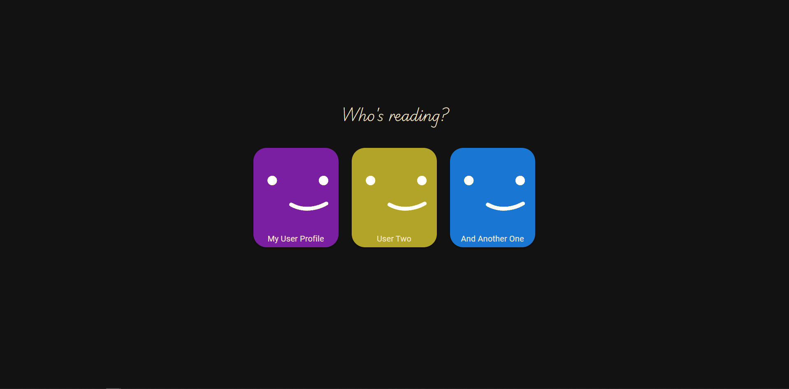
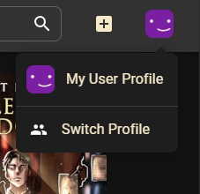
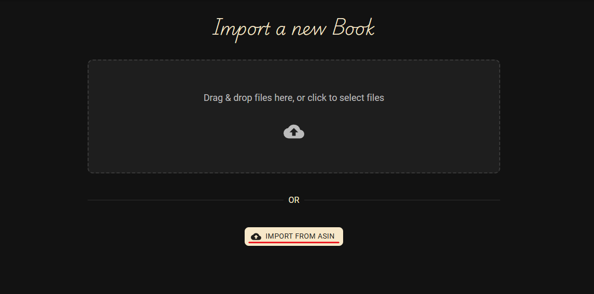
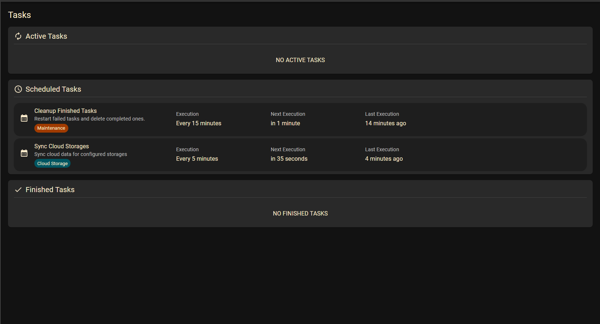
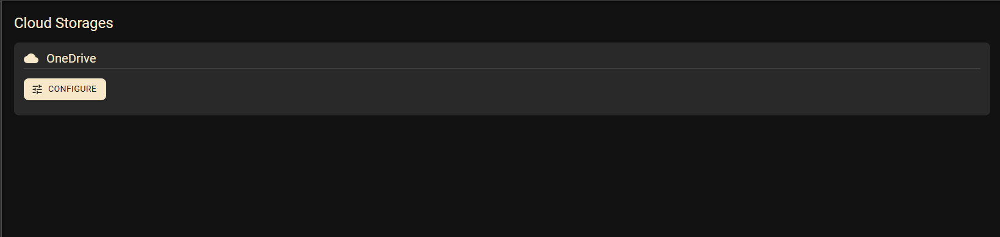
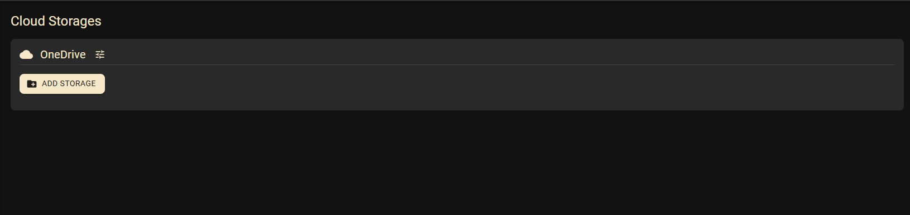
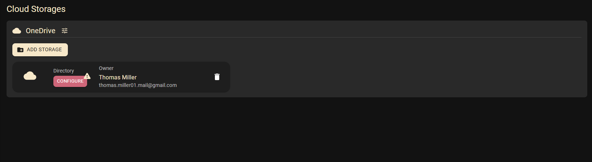
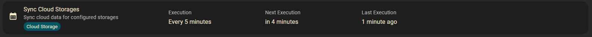

# References

**Table of Contents:**

- [User Profiles](#user-profiles)
  - [Settings](#settings)
- [Library](#library)
- [Search](#search)
- Books
  - [Add a Book](#add-a-book)
  - [Edit a Book](#edit-a-book)
  - [Delete a Book](#delete-a-book)
- Series
  - [Merge two Series](#merge-two-series)
- [Metadata](#metadata)
- [File Handling](#file-handling)
- [Tasks](#tasks)
- [Cloud Storage](#cloud-storage)
- [Global Settings](#global-settings)

## User Profiles

User profiles store the individuell settings and metadata (like ratings and notes) of a user.

### Create a new user profile

1. Click on the "+" (plus) button to start creating a new user profile

2. Fill in the username and click the "Save" button

### Select a user profile

1. On the user profile selection screen are all user profiles shown
2. Click on the profile you want to select

### Switch to another user profile

1. Click on your user icon on the top right of the page
2. Click the "Switch Profile" button
3. This will navigate you to the user profile selection, see [Select a user profile](#select-a-user-profile)

### Settings

Settings allow each profile to customize behavior and layout preferences, such as whether the sidebar should be open or closed.

KapitelShelf automatically syncs settings per user profile across devices, prioritizing them in the following order:

1. **Cloud Storage** (highest priority - if available)
2. **Local Storage** (used if the cloud is unavailable or offline)
3. **Default Value** (used only if no prior value is saved in either cloud or local)

On first load, KapitelShelf will attempt to fetch the settings from the cloud. If this fails (e.g. offline), it falls back to locally stored settings. If neither exist, the default is used and synced to both cloud and local storage once possible.

> ⚠️ Settings are saved and synced **per profile**, and automatically reloaded when switching between profiles.

## Library

1. Click on `Library` to see your book collection

> ℹ️ On the library page, you’ll see all your series listed.   To view the books in a specific series, see [4. View Series Details](./quickstart.md#4-view-series-details).

## Search

> The search will look through the `title`, `description`, `series name`, `author`, `tags` and `categories`.

Use the **search bar** at the top of the page to find books in your collection by title, author or keyword.

## Add a Book

### Manually

1. Click the `+` button on the top right.

2. Click the `Create Book` button _(directly below)_.

3. Fill out the book details: _title_, _description_, ...
4. _**[Optional]**_ Import metadata as described in [Import Metadata for a Book](#import-metadata-for-a-book).
5. Click the `Create Book` button on the bottom right.

### Import from a File

1. Click the `+` button on the top right as before.
2. Click the `Import Book` button.

3. **Drag & Drop** your book files into the dotted area _or_ **click on the dotted area** and select your books to import.
4. Click on `View` in the success notification to navigate to the newly imported book.

### Import in bulk from .csv

KapitelShelf supports importing your entire library from a CSV file, allowing you to quickly add multiple books at once.

1. Go to the `Import Book` dialog as described in [Import from a File](#import-from-a-file).
2. Select your prepared `.csv` file.
3. KapitelShelf will process each row in the file and create a new book for each.
4. You will receive a summary of the books created and any errors.

> ℹ️ If a row is missing a required property (e.g. Title), the entry will be skipped.

#### Required Format

Your CSV file must have the following columns and structure:

| Title\*  | Description | Author   | ReleaseDate | SeriesName | SeriesNumber | Pages | Tags                | Categories          | LocationType | LocationValue |
| -------- | ----------- | -------- | ----------- | ---------- | ------------ | ----- | ------------------- | ------------------- | ------------ | ------------- |
| `string` | `string`    | `string` | `string`    | `string`   | `int`        | `int` | `string,string,...` | `string,string,...` | `enum`       | `string`      |

- **Title**: `string` (required)
- **Description**: `string`
- **Author**: `string` (FirstName and LastName, separated by a space)
- **ReleaseDate**: `string` (UTC format: `YYYY-mm-ddTHH:MM:ss.fffZ`)
- **SeriesName**: `string`
- **SeriesNumber**: `int` (>= 0)
- **Pages**: `int` (>= 0)
- **Tags**: `string` (comma-separated list)
- **Categories**: `string` (comma-separated list)
- **LocationType**: `string` (`Physical`, `KapitelShelf`, `Kindle`, `Skoobe`, `Onleihe`, `Library`)
- **LocationValue**: `string` (set only if LocationType requires a value)

#### Example Rows

| Title      | Description    | Author   | ReleaseDate              | SeriesName | SeriesNumber | Pages | Tags                | Categories                    | LocationType | LocationValue                          |
| ---------- | -------------- | -------- | ------------------------ | ---------- | ------------ | ----- | ------------------- | ----------------------------- | ------------ | -------------------------------------- |
| My Title   | My Description | Jane Doe | 2023-04-23T15:20:17.357Z | My Series  | 1            | 100   | Tag1,Tag2           | Category1,Category2           | Skoobe       | https://www.skoobe.de/books/mybook     |
| My Title 2 | My Description | Jane     | 2023-04-23T15:20:17.357Z | My Series  | 1            | 100   | My Special Tag,Tag2 | My Special Category,Category2 | Kindle       | https://www.amazon.de/mybook/dp/bookid |

### Import from ASIN

> Learn about ASINs on [amazon.com](https://sell.amazon.com/blog/what-is-an-asin).

Importing a book from an ASIN is similar to importing from a file.

1. First click the `+` button on the top right as before.
2. The click the `Import Book` button.
3. Now click on the `Import from ASIN` button

4. Fill in the ASIN in the provided field.
5. Click the `Import Book` button.

## Edit a Book

Visit the book details page and click the `Edit` _(pencil icon)_ button.

Now edit the book details: _title_, _description_, ...

Click the `Edit Book` button on the bottom right to save your changes.

## Delete a Book

> ℹ️ Deleting a **book** will delete **all associated files** (e.g. cover, book file).

> ⚠️ Deleting a **series** will also delete **all associated books**.

Visit the book details page and click the `Delete` _(trash icon)_ button.

Now **confirm** the deletion in the dialog via the red `Delete` button.

## Merge two Series

**Problem:** If the books from the same series have the series some differently spelled.
**Solution:** You can now merge all the books from a source series into a target series with one button click.

1. Click the "three dots" on the page of the series page you want **to remove**
2. Click on the "Merge Series" button

> The Merge Series Dialog automatically loads all series with a similar name.

3. Select the target series you want to merge into.

> If the series does not show up, you can use the textfield on the top to search for the full name of the target series.

4. Click the "Merge" button.

You will automatically be navigated to the target series, once the merging completes successfully.

## Metadata

### Import Metadata for a Book

1. Click the "Import Metadata" button

KapitelShelf will automatically look for book metadata from the available sources.

> The book **title** will be used as the search key.

2. Click on a book to import the shown metadata

> The metadata will overwrite existing values.

### Filter sources

You can exclude/include metadata sources by clicking on them.

## File Handling

If a **file is available** for the book, you can download it using the `Download` button below the cover image.

## Tasks

KapitelShelf uses tasks to perform background operations, such as recurring actions or handling long-running actions.

> Tasks start automatically as part of the system's routines or they may be triggered by user actions (e.g. configuring a new cloud storage).

### Viewing Tasks

You can quickly access the tasks page using the shortcut in your profile context menu. This menu also displays the number of currently running tasks.

Alternatively, you can reach the tasks page via the settings sidebar. The tasks entry will appear only after you clicked on the settings option.

### Common Attributes

Each task displays several common attributes:

| Attribute      | Description                                                                           |
| -------------- | ------------------------------------------------------------------------------------- |
| Type (icon)    | Tasks can either be cronjobs (run at a scheduled time), recurring or single execution |
| Name           | The name of the task                                                                  |
| Description    | The task description, often has more detailed information                             |
| Category       | The general category of the task, color coded for easier readability.                 |
| Next execution | The time when the task will be executed next                                          |
| Last execution | The time when the task was last executed                                              |

Some specific tasks and types can have additional attributes.

#### Running Task

| Attribute | Description                                                                               |
| --------- | ----------------------------------------------------------------------------------------- |
| Progress  | The progress percentage, until the task is finished.                                      |
| Message   | A message set by the task. Can be download speed, ETA (Estimated Time of Arrival) or more |

#### Finished Task

| Attribute       | Description                                                   |
| --------------- | ------------------------------------------------------------- |
| Finished Reason | The reason for the task to finish. Can be completed or error. |

#### Type Cronjob

| Attribute | Description            |
| --------- | ---------------------- |
| Execution | The execution schedule |

### Tasks View

## Cloud Storage

KapitelShelf allows you to import books automatically from your cloud storages.

You can reach the cloud storages page via the settings sidebar. The cloud storages entry will appear only after you clicked on the settings option.

### Configure new Cloud

Before a cloud storage can be created, the corresponding cloud first has to be configured.
This configuration depends on the cloud and can be different.

1. Just click the "Configure" button of the cloud you want to use.
2. Then follow the instructions.

### Add new storage

After configuring the cloud, you can add your first cloud storage.

1. Click the "Add Storage" button
2. You will be redirected to the cloud authentication
3. Login with your account

#### !! Configure directory !!

After adding the storage, you have to configure which directory from your cloud should be used by KapitelShelf.

1. Click the red "Configure" button and select the directory to use.

#### Initial Download

After the directory is configured, KapitelShelf will start a [Task](#tasks) that will initially download the cloud directory.

### Automatic Sync

The cloud storage will automatically sync with your cloud every 5 minutes.

Depending on the cloud, either a bi-directional sync or a uni-directional sync is supported.

> You can lookup if your storage supports bi-directional synching here: https://rclone.org/bisync/#supported-backends

#### Bi-directional Sync

The bi-directional sync will propagate any changes from the cloud locally, and any local changes to the cloud. This allows KapitelShelf to add new files and update existing metadata, an you automatically having a backuped copy in the cloud.

> The `bisync` feature of `rclone` is currently in beta. If you always want to use `sync` (uni-directionally), see [Disable rcloen bisync in Settings](#disable-rclone-bisync-in-settings).

#### Uni-directional Sync

The uni-directional sync will propagate any changes from the cloud locally.

#### Disable rclone bisync in Settings

Because `rclone bisync` is still in beta, you can disable its use in the Settings. Instead `rclone sync` will be used for uni-directional synching.

> _Coming Soon_

## Global Settings

Global settings affect the whole KapitelShelf instance, instead of single users.

| Category      | Setting                | Default Value | Description                                                                 | Note                                               |
| ------------- | ---------------------- | ------------- | --------------------------------------------------------------------------- | -------------------------------------------------- |
| Cloud Storage | Enable `rclone bisync` | `false`       | Allows two-way synchronization between KapitelShelf and the cloud provider. | _Experimental_, when false, `rclone sync` is used. |
