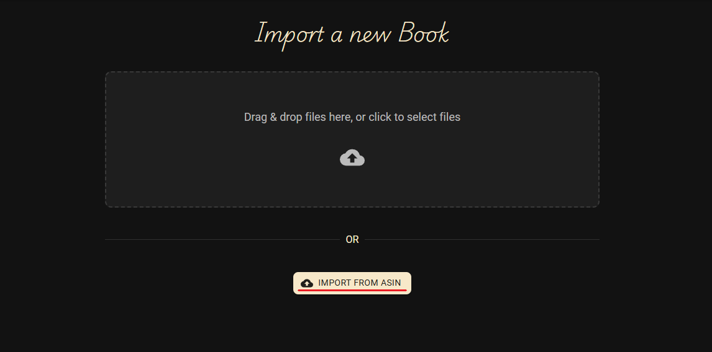

# Book Management

KapitelShelf supports manual entry, file imports, metadata enrichment, and removal workflows so you can maintain an organised library.

## Add a Book Manually

1. Click the **`+`** button on the top right.

   

2. Select **Create Book**.

   

3. Fill out the book details such as title and description.
4. _Optional:_ Import metadata as described in [Import Metadata for a Book](./metadata.md#import-metadata-for-a-book).
5. Click **Create Book** to save the entry.

## Import from a File

1. Click the **`+`** button on the top right.
2. Choose **Import Book**.

   

3. Drag and drop your book files into the dotted area, or click the area to select files manually.
4. After a successful import, click **View** in the notification to open the new book.

   

## Bulk Import from CSV

KapitelShelf can ingest a full library from a CSV file, creating a book for each row.

1. Open the **Import Book** dialog as described above.
2. Select your prepared `.csv` file.
3. KapitelShelf processes each row and creates the matching books.
4. A summary lists the books created and any errors encountered.

> ℹ️ Rows missing required properties (e.g. the Title) are skipped.

### Required Format

Use the following column structure for successful imports:

| Title*  | Description | Author   | ReleaseDate | SeriesName | SeriesNumber | Pages | Tags                | Categories          | LocationType | LocationValue |
| ------- | ----------- | -------- | ----------- | ---------- | ------------ | ----- | ------------------- | ------------------- | ------------ | ------------- |
| `string` | `string`    | `string` | `string`    | `string`   | `int`        | `int` | `string,string,...` | `string,string,...` | `enum`       | `string`      |

- **Title**: `string` (required)
- **Description**: `string`
- **Author**: `string` (first name and last name separated by a space)
- **ReleaseDate**: `string` (UTC format `YYYY-mm-ddTHH:MM:ss.fffZ`)
- **SeriesName**: `string`
- **SeriesNumber**: `int` (>= 0)
- **Pages**: `int` (>= 0)
- **Tags**: `string` (comma-separated list)
- **Categories**: `string` (comma-separated list)
- **LocationType**: `string` (`Physical`, `KapitelShelf`, `Kindle`, `Skoobe`, `Onleihe`, `Library`)
- **LocationValue**: `string` (set only if the chosen LocationType requires a value)

### Example Rows

| Title      | Description    | Author   | ReleaseDate              | SeriesName | SeriesNumber | Pages | Tags                | Categories                    | LocationType | LocationValue                          |
| ---------- | -------------- | -------- | ------------------------ | ---------- | ------------ | ----- | ------------------- | ----------------------------- | ------------ | -------------------------------------- |
| My Title   | My Description | Jane Doe | 2023-04-23T15:20:17.357Z | My Series  | 1            | 100   | Tag1,Tag2           | Category1,Category2           | Skoobe       | https://www.skoobe.de/books/mybook     |
| My Title 2 | My Description | Jane     | 2023-04-23T15:20:17.357Z | My Series  | 1            | 100   | My Special Tag,Tag2 | My Special Category,Category2 | Kindle       | https://www.amazon.de/mybook/dp/bookid |

## Import from ASIN

> Learn more about ASINs at [amazon.com](https://sell.amazon.com/blog/what-is-an-asin).

1. Click the **`+`** button on the top right.
2. Choose **Import Book**.
3. Select **Import from ASIN**.

   

4. Enter the ASIN in the provided field.
5. Click **Import Book** to fetch the metadata.

   

## Edit a Book

Open the book detail page and select the **Edit** (pencil) icon.

Update the necessary fields and confirm with **Edit Book**.

## Delete a Book

> ℹ️ Deleting a **book** also removes associated files such as covers or attachments.
>
> ⚠️ Deleting a **series** removes the series and **all books** inside it.

On the book detail page, click the **Delete** (trash) icon.

Confirm the action via the red **Delete** button in the dialog.

