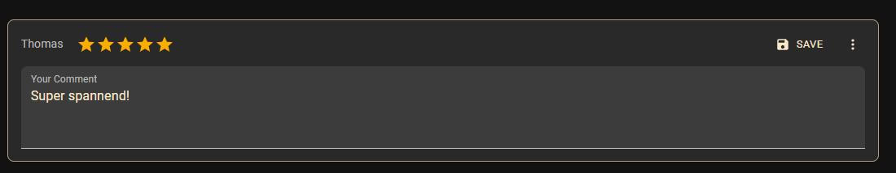

# Book Ratings

This section explains how KapitelShelf stores and displays user ratings for books and series.

## Overview

- **Book rating**: a per-user value attached to a book (stored in the active user's profile).
- **Series rating**: a calculated value from all book ratings inside a series for all users.

## Series Rating in Library

Series cards in the Library show the calculated series rating (average of user ratings for books in the series). The card displays the average value so you can quickly gauge popularity at a glance.

## Book Rating

On a Book detail page you will see two related values:

- **Your rating**: the rating you have assigned to this book.
- **Calculated rating**: the average rating from all users for this book and the total number of ratings.

### Add new rating

1. Open a Book detail page.
2. Click the rating button (stars) and select a value.
3. The rating is saved to your active user profile and the calculated averages update immediately.

### Edit existing rating

1. Click the edit button on your rating on the Book detail page.
2. Choose a different value, the new value replaces the previous rating for your profile.

### Delete existing rating

1. Open the Book detail page and click the options menu (three vertical dots) on your rating.
2. Select the option to remove your rating.
3. Deleting your rating removes it from your profile and the aggregated averages update accordingly.

## Calculated rating from all users

- Calculated ratings are calculated from the set of all user ratings for the entity (book or series).
