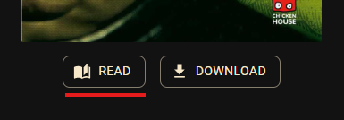
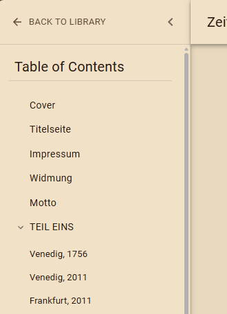
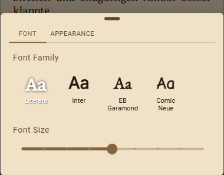

# Book Reader

KapitelShelf includes a built-in book reader for supported local book files. Use it to read inside the app, move through chapters and pages, and adjust the reading view without leaving your library.

## What You Can Open in the Reader

Use the built-in reader for books that are stored as local KapitelShelf files.

The built-in reader currently supports these in-app formats:

- `EPUB`
- `PDF`
- `FB2`
- `TXT`

What happens with other book locations:

- Books with a local KapitelShelf file can show a **Read** button on the book detail page.
- Books stored as Kindle, Skoobe, or Onleihe links open with that provider instead of the built-in reader.
- Books marked as **Physical** or **Library** stay visible in your collection, but they cannot be opened in the built-in reader.

> ℹ️ Seeing **Read** means the book has a local file attached. The built-in reader itself currently opens only the formats listed above.

## Open a Book from Its Detail Page

1. Open the book detail page.
2. Click **Read**.
3. Start reading inside KapitelShelf.

If a local file is better handled by another app, **Download** remains available from the same book detail page.

## Move Through the Book

Once the book is open, you can move through it in the way that fits your device.

On phones and tablets, you can:

- swipe left or right
- tap the left or right edge of the page
- open the table of contents and jump to another part of the book

On desktop browsers, you can:

- click the left or right page areas beside the reading surface
- use `ArrowLeft` and `ArrowRight`
- open the table of contents and jump to another part of the book

> ℹ️ KapitelShelf keeps the current section and page stored, so refreshing the page returns you to the same place in the book.

## Table of Contents

Open the sidebar from the reader toolbar to move to another chapter or section quickly.

- If the source file contains a table of contents or outline, KapitelShelf displays it in the sidebar.
- Nested entries can be expanded and collapsed.
- Selecting an entry jumps to the matching section in the reader.

If a book does not contain a usable table of contents, the sidebar shows `No table of contents available.` instead.

## Change Font and Appearance

Open the settings button in the reader toolbar to customize the reading view. The settings drawer has a **Font** tab and an **Appearance** tab.

### Font settings

Use the **Font** tab to adjust how the book text is displayed.

- Choose a font family.
- Increase or decrease the font size.

These settings are saved for future reader sessions on the same browser or app device.

### Appearance settings

Use the **Appearance** tab to change how the reader itself looks.

- **Page Color** offers `Light`, `Sepia`, and `Dark`.
- The selected page color changes the reader only. It does not change the rest of KapitelShelf.
- Your selected reader appearance is saved for future reader sessions on the same browser or app device.

### Lock current orientation on mobile

In the mobile app, the **Appearance** tab also includes **Lock current orientation**.

When enabled, KapitelShelf locks the reader to the way you are currently holding the device and restores that choice when you open the reader again. Turn it off to go back to normal rotation behavior.

This option is only shown in the mobile app.

## Understand Progress and Common Limitations

KapitelShelf shows lightweight reading status around the page:

- current time
- battery status, when your device or browser makes that information available
- `Page X of Y`
- reading progress percentage

> ℹ️ `Page X of Y` is an estimate based on your current reading layout. It helps you track progress, but it is not a fixed publisher page number and can differ across devices or reader settings.

### PDF text limitations

KapitelShelf reads PDFs from extractable text content.

- A PDF page with no extractable text can be skipped in the normal reading flow.
- If the entire PDF has no extractable text, KapitelShelf shows `No extractable text found in this PDF.`

This most often affects scanned or image-only PDFs.

## Related Guides

- [Book Management](./book-management.md)
- [File Handling](./file-handling.md)
- [Library and Search](./library-and-search.md)
- [Quickstart Guide](../quickstart.md)
