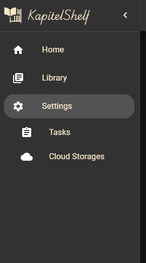

# Cloud Storage

KapitelShelf can import books directly from your cloud storage providers.

Access the Cloud Storages page via the settings sidebar (the entry appears after choosing the settings option).

## Configure a New Cloud Provider

Before adding a storage, configure the provider you plan to use. The setup flow varies depending on the provider.

1. Click **Configure** for the desired provider.
2. Follow the on-screen instructions.

## Add Cloud Storage

Once configured, add your first storage instance.

1. Click **Add Storage**.
2. Complete the provider’s authentication steps.
3. Sign in with the appropriate account.

## Configure the Storage Directory

After authentication, choose the directory KapitelShelf should synchronise.

1. Click the red **Configure** button.
2. Select the directory to use.

## Initial Download

Once the directory is set, KapitelShelf launches a [task](./tasks.md) to download the cloud contents for the first time.

## Automatic Sync

KapitelShelf syncs with your cloud storage every 5 minutes.

Depending on the provider, either bi-directional or uni-directional sync is available.

> Supported backends for bi-directional sync are listed at <https://rclone.org/bisync/#supported-backends>.

### Bi-directional Sync

A bi-directional sync propagates changes from KapitelShelf to the cloud and vice versa, keeping both copies aligned.

> The `bisync` feature of `rclone` is currently in beta. If you prefer a one-way sync, see the next section.

### Uni-directional Sync

A uni-directional sync copies updates from the cloud into KapitelShelf.

## Disable rclone bisync in Settings

Because `rclone bisync` remains in beta, KapitelShelf lets you disable it in favour of `rclone sync` for uni-directional behaviour.

Toggle the **Enable rclone bisync** option in [Global Settings](./global-settings.md#cloud-storage) to switch between bi-directional and uni-directional sync.
