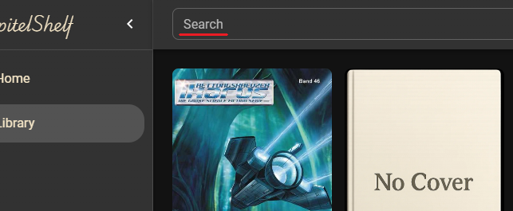

# Library and Search

Use the library view to browse your collection and the global search to surface items quickly.

## Browse the Library

1. Click **Library** to see your collection organised by series.

   

   To drill into a specific series, open it from the list to view all associated books.

## Search Across Your Collection

Use the **search bar** at the top of the page to find books by title, description, series name, author, tags, or categories.

> The search scans across `title`, `description`, `series name`, `author`, `tags`, and `categories` fields.
