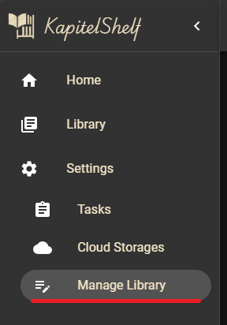
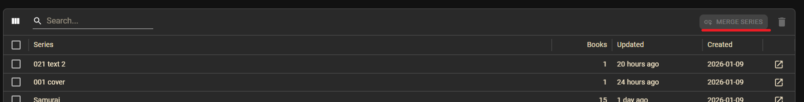
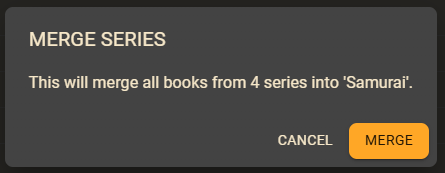

# Library Management

Manage a potentially large number of books in your library through dedicated tabs for organizing series, books, authors, categories and tags. This management interface allows you to browse, edit, delete and merge library items in bulk.

## Access the Management Interface

1. Click **Settings** in the sidebar.
2. Select **Manage Library**.

   

The Manage Library page displays tabs for each manageable item: **Series**, **Books**, **Authors**, **Categories** and **Tags**.

## Common Features

All management tabs share consistent functionality for browsing and organizing your library items.

### Browse and Filter Items

Each tab displays a table of items with the following features:

- **Search**: Use the search field to filter items by name or relevant properties.
- **Sort**: Click column headers to sort by that column (e.g., alphabetically, by book count, or by date).
- **Pagination**: Navigate through large collections using the pagination controls at the bottom.
- **Column Customization**: Click the **Columns** icon to show or hide specific columns.

### Edit Items Inline

For most fields, you can edit items directly in the table:

1. Double-click a cell to enter edit mode.
2. Modify the value as needed.
3. Press **Enter** to save or **Escape** to cancel.

> ℹ️ Changes are saved immediately to the backend.

### Delete Items

Select one or more items using the checkboxes on the left, then click the **Delete** button in the toolbar.

> ⚠️ Deleting items affects your library:
>
> - Deleting a **book** removes the book and associated files (covers, attachments).
> - Deleting a **series** removes the series and **all books** within it.
> - Deleting an **author**, **category**, or **tag** removes only the metadata, books are not deleted.

## Series Management

Manage all series in your library, view associated books and merge duplicates.

### Merge Series

When you have duplicate series (e.g., "My Series" and "My series"), merge them into a single entry:

1. Select two or more series using the checkboxes.
2. Click **Merge Series** in the toolbar.

   

3. Confirm the merge dialog. The first selected series becomes the target.

   

   All books from the source series will be reassigned to the target series.

## Books Management

Manage individual books in your library with the ability to edit metadata and delete entries.

### Edit Book Details

1. Double-click a cell to edit the field.
2. For fields with autocomplete (like **Author**), start typing to see suggestions.
3. For **Release Date**, click the "Calender" icon to open a date picker.
4. Press **Enter** to save changes.

## Authors Management

Manage authors in your library, including merging duplicates when the same author is listed under different name variations.

### Merge Authors

Similarly to the series, you can also merge multiple authors, if the same author appears under different name variations (e.g., "John Smith" and "J. Smith").

To merge two authors, go to the authors tab and follow the same instructions that are detailed in the series tab.

## Categories Management

Manage categories assigned to your books, including merging duplicate category names.

### Merge Categories

Similarly to the series, you can also merge multiple categories, if you have duplicate categories (e.g., "Fiction" and "fiction").

To merge two categories, go to the categories tab and follow the same instructions that are detailed in the series tab.

## Tags Management

Manage tags assigned to your books, including merging duplicate tag names.

### Merge Tags

Similarly to the series, you can also merge multiple categories, if you have duplicate tags (e.g., "Sci-Fi" and "SciFi").

To merge two tags, go to the tags tab and follow the same instructions that are detailed in the series tab.
