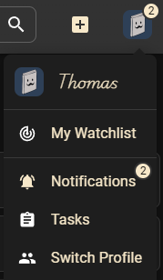
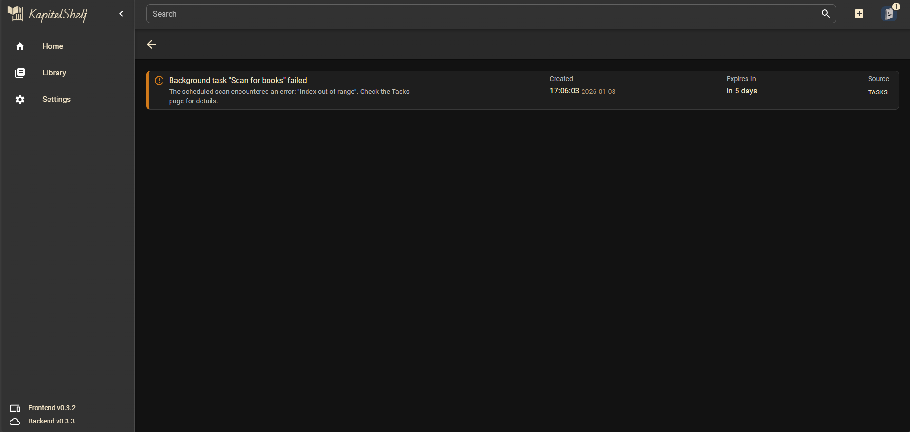

# Notifications

Notifications let you know about important events in KapitelShelf, so you don't miss tasks, errors or other items that need your attention.

## Where to find notifications

- **Header badge (top-right)**: shows how many unread notifications you have. If there is a critical unread message, the badge and icon become highlighted red

  Header badge showing unread count and critical indicator.

  

- **Notifications page**: lists your notifications. Use it to read messages, filter by type or severity, and mark items as read

  Notifications page with filters and list.

  

- **Notification detail**: open a notification to read the full message and view related (grouped) messages

  Open notification showing full message and grouped items.

  

## Read and manage

- Click the header badge or open **Notifications** from the main menu
- Click a notification to read its full content
- Use **Read** on an individual item, or **Read All** to clear all unread messages

## Filters and visibility

- Filter by **Type** (Info, Success, Warning, Error, System) and **Severity** (Low, Medium, High, Critical)
- System messages may be hidden by default to keep the list focused
- Adjust filters to hide categories you don't want to see

## Grouped messages and read behaviour

- Messages with the same title are grouped, the group shows how many related messages it contains
- Marking a grouped notification as read marks all messages in that group as read
- Opening a notification detail can mark it as read when there are new child messages

## Lifespan

Notifications are cleaned up automatically after a short period (typically about a week).

## Tips

- If the badge shows unread items but none appear, clear any active filters on the Notifications page.
