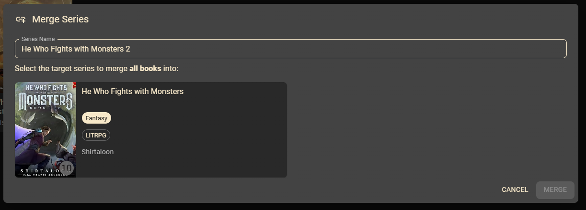

# Series Management

Merge duplicate series to keep your catalogue tidy when titles vary slightly.

## Merge Two Series

**Problem:** Books from the same series might have slightly different names, creating duplicate series.

**Solution:** Merge a source series into a target series in a few clicks.

1. Open the series you want to remove and select the **three dots** menu.
2. Click **Merge Series**.

   

   The merge dialog automatically suggests similarly named series.

3. Choose the target series.

   

   If the series you need is not listed, use the search field at the top to find it.

4. Click **Merge**. KapitelShelf redirects you to the target series once the process finishes successfully.
