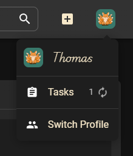

# Tasks

KapitelShelf uses tasks for background work, such as long-running imports or recurring maintenance jobs. Tasks may start automatically or be triggered by user actions (for example, configuring a new cloud storage).

## Access the Tasks View

- Open the profile context menu to access the tasks page quickly. The menu also displays the number of running tasks.

  

- Alternatively, open the settings sidebar and select **Tasks** (the entry appears after you click the settings option).

  

## Common Task Attributes

Each task exposes a shared set of details:

| Attribute      | Description                                                                           |
| -------------- | ------------------------------------------------------------------------------------- |
| Type (icon)    | Indicates whether the task is a cronjob, recurring task, or single execution.        |
| Name           | Human-readable name of the task.                                                      |
| Description    | Additional context about what the task does.                                         |
| Category       | Colour-coded category for quick recognition.                                         |
| Next execution | Scheduled time for the next run.                                                     |
| Last execution | When the task last completed.                                                        |

Some tasks include extra information depending on their state or type.

## Task Types and Additional Attributes

### Running Task

| Attribute | Description                                                                                |
| --------- | ------------------------------------------------------------------------------------------ |
| Progress  | Completion percentage.                                                                     |
| Message   | Task-defined message such as download speed or estimated time remaining.                   |

### Finished Task

| Attribute       | Description                                                   |
| --------------- | ------------------------------------------------------------- |
| Finished Reason | Indicates whether the task completed successfully or errored. |

### Type Cronjob

| Attribute | Description                                   |
| --------- | --------------------------------------------- |
| Execution | Cron expression or schedule describing when the job runs. |

## Tasks View

