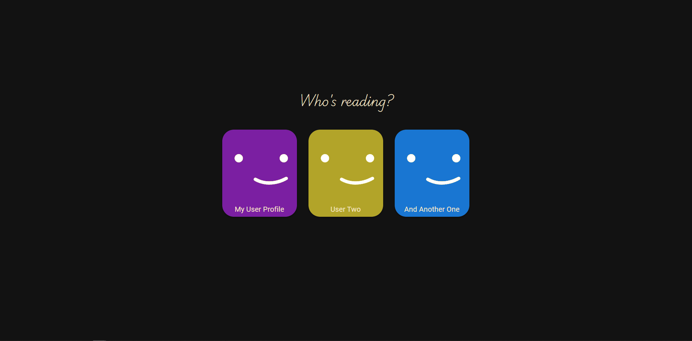
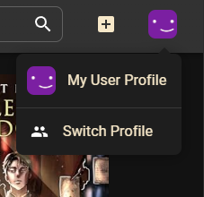

# User Profiles

User profiles store individual settings and metadata such as ratings and notes. Every interaction is scoped to the active profile so that preferences stay isolated per reader.

## Create a New User Profile

1. Click the **`+` (plus)** button to start creating a new user profile.

   

2. Enter the username and click **Save**.

   

## Select a User Profile

1. The profile selection screen lists every available profile.
2. Click the profile you want to activate.

   

## Switch Between User Profiles

1. Open the profile menu via your avatar in the top-right corner.
2. Choose **Switch Profile**.
3. You will return to the selection screen described above.

   

## Profile Settings

Settings control behaviour and layout preferences such as the default sidebar state. KapitelShelf automatically syncs each profile's settings in the following order:

1. **Cloud Storage** (highest priority, used when available)
2. **Local Storage** (fallback if the cloud cannot be reached)
3. **Default Value** (used only when no previous value exists)

On first load, KapitelShelf attempts to fetch settings from the cloud. If that fails—such as when you are offline—it falls back to locally stored settings. When neither are available, defaults are applied and synced once a storage option becomes available.

> ⚠️ Settings are saved **per profile** and automatically reloaded when switching users.
