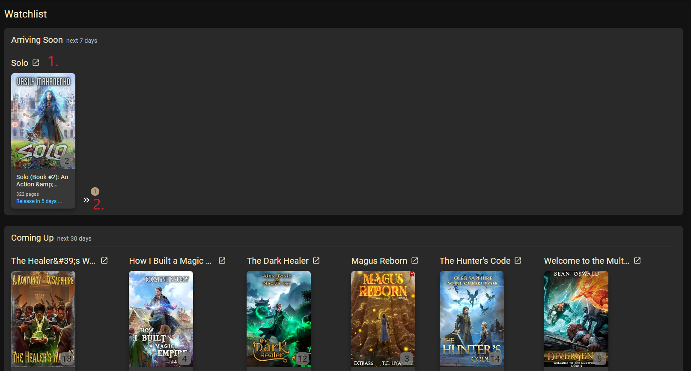
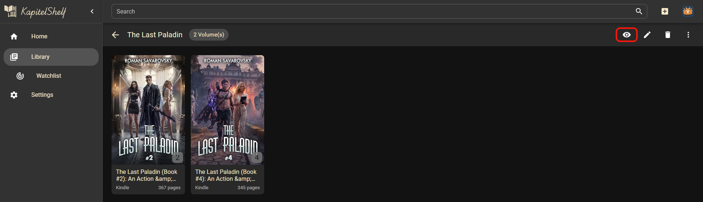
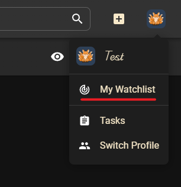

# Watchlist

Track upcoming volumes of your favourite series, even if the new books are not yet part of your library. KapitelShelf checks for newly announced volumes and release dates automatically.

> ⚠️ The watchlist currently supports series whose books are stored in **Kindle** locations.

The watchlist page is organised into three sections:

1. **Arriving Soon** - books releasing within the next 7 days.
2. **Coming Up** - books releasing within the next 30 days.
3. **Further Ahead** - books scheduled for later or with no confirmed next volume.

From the watchlist you can open series pages, inspect all upcoming volumes and remove entries when you no longer need them.

## Add or Remove a Series

1. Open the series you want to monitor.
2. Click the **Eye** icon to add it to the watchlist.

   

3. Access the watchlist via the profile menu in the top-right corner.

   

If the watchlist button is missing, the series does not use a supported location. To remove a series from the watchlist, click the icon again: it becomes a crossed-out eye when the series is being tracked.
